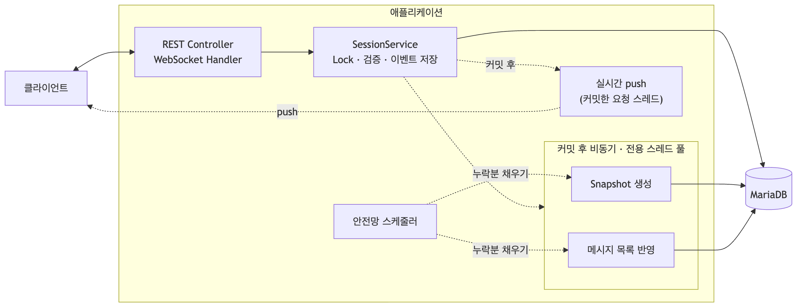

# 설계 문서

실시간 1:1 채팅과 이벤트 기반 특정 시점 상태 복원 기능의 설계 결정, 근거, 트레이드오프.

관련 문서: [ERD / DDL](erd.md) · [REST API](api.md) · [WebSocket 프로토콜](websocket.md) · [쿼리 최적화](query.md) · [OpenAPI](openapi.json)

## 한눈에 보기

| 주제 | 결정 | 자세히 |
|---|---|---|
| 원본 데이터 | 모든 변경을 `event` 테이블에 append-only로 저장. 나머지 테이블은 이벤트로 다시 만들 수 있는 Projection | [2장](#이벤트가-유일한-원본) |
| Projection 갱신 | 요청 검증에 쓰는 상태(참여자, 세션 상태)는 동기, 조회 전용(메시지 목록, Snapshot)은 커밋 후 비동기 | [2장](#projection-갱신-기준) |
| 중복 이벤트 | 클라이언트가 만든 eventId에 전역 UNIQUE. 같은 내용이면 200 + 처음 결과, 다르면 409 | [3장](#3-중복-이벤트-처리) |
| 순서 기준 | session 행 Lock 안에서 세션별 sequence 발급. 저장 시각은 DB 시각 | [4장](#4-순서-처리) |
| 동시성 | 세션 단위 비관적 Lock으로 직렬화. Lock 대기 3초 넘으면 503 | [5장](#처리-순서와-lock) |
| 실시간 전달 | 커밋 후에만 push (best-effort). 정합성은 재연결 재전송이 보장 | [5장](#실시간-push) |
| presence | DISCONNECT/RECONNECT는 서버가 연결 상태를 보고 생성. 참여자당 연결 하나 | [6장](#presence) |
| 세션 상태 | "중단" = 참여자 전원의 연결이 끊긴 일시 중단. 참여자 상태로 계산 | [6장](#세션-상태) |
| 상태 복원 | 시점(`at`)을 sequence로 바꾼 뒤 가장 가까운 Snapshot + 그 이후 이벤트 Replay. 복원 로직은 순수 함수 하나를 공유 | [7장](#7-상태-복원) |
| Snapshot | 1000개 간격(데모 20)으로 커밋 후 비동기 생성. 메시지는 최근 100개만 담는 캐시 | [7장](#snapshot-주기와-저장-형식) |
| 비동기 처리 | 전용 스레드 풀 + 재시도 3회. 최종 실패는 안전망 스케줄러가 원본(event)에서 다시 계산. 멱등 처리로 중복 실행해도 결과 동일 | [8장](#8-비동기-처리) |
| 재연결 | 클라이언트가 마지막으로 적용한 sequence로 재연결 → 놓친 이벤트를 순서대로 재전송한 뒤 실시간 전환 | [9장](#9-재연결-정합성) |
| 수평 확장 | 상태는 전부 DB라 저장·정합성은 그대로 유지. 서버 메모리에 있는 연결 맵만 공유 저장소와 서버 간 전파가 필요 | [10장](#10-수평-확장) |
| 관측 | key=value 로그(sessionId, sequence 기준 검색) + Micrometer 메트릭. 추적은 미구현 | [11장](#11-관측-가능성) |
| 장애 대응 | 서버 다운 / DB 장애 / 정합성 이슈별 감지 → 완화 → 복구, 장애 주입 테스트로 검증 | [12장](#12-장애-대응) |

---

## 1. 개요



<sub>그림 원본: [images/architecture.mmd](images/architecture.mmd) (Mermaid)</sub>

- REST와 WebSocket 두 입구로 받지만 검증·Lock·저장은 `SessionService` 하나에서 처리한다. 경로와 무관하게 결과가 같다.
- 커밋 후 작업 중 Snapshot 생성과 메시지 목록 반영은 전용 스레드 풀에서 비동기로 실행되고, 실패하면 안전망 스케줄러가 채운다. 실시간 push는 커밋한 요청 스레드에서 바로 보낸다 ([5장](#실시간-push)).
- 테이블 6개: `event`(원본), `session`·`participant`(동기), `message_projection`·`message_projection_checkpoint`·`snapshot`(비동기). DDL과 인덱스 근거는 [erd.md](erd.md)에 있다.

### 기술 스택

| 선택 | 이유 |
|---|---|
| Java 25 + Spring Boot 4.1 | Virtual Thread 사용. WebSocket 연결 객체가 `synchronized`를 쓰는데, Java 21은 그 안에서 Virtual Thread가 고정(pinning)된다. Java 24(JEP 491)부터 해결 |
| MariaDB 11.4 | 비관적 Lock + Lock 대기 타임아웃, JSON 컬럼, 마이크로초 시각(`DATETIME(6)`) |
| Spring Data JPA | 동기 Projection 갱신, `@Lock(PESSIMISTIC_WRITE)` |
| Flyway | 앱 시작 시 스키마 자동 적용 + 적용 이력·체크섬 검증. `ddl-auto: validate`로 엔티티와 일치 확인 |
| raw WebSocket | 1:1이라 STOMP의 topic 구독이 필요 없고, 재전송 순서를 연결 하나에서 직접 제어하기 쉽다 ([13장](#13-통신-방식-비교)) |
| Testcontainers | Lock, JSON, UNIQUE 동작을 실제 MariaDB로 검증. H2는 이 동작이 달라서 쓰지 않음 |
| Micrometer | 메트릭 측정 지점. 수집 백엔드와 분리돼 있어 Prometheus 등은 의존성만 추가하면 연동 |

시각은 KST로 저장하고 API 응답에 `+09:00`을 붙인다. 여러 시간대가 섞이는 서비스라면 UTC 저장이 유리하다.

---

## 2. 이벤트 모델

### 이벤트가 유일한 원본

**결정**: 세션에서 일어난 모든 일을 `event` 테이블에 append-only로 쌓는다. 나머지 테이블은 전부 이벤트로부터 다시 만들 수 있는 Projection이다.

| 이벤트 | 만드는 쪽 |
|---|---|
| `SESSION_CREATED`, `JOIN`, `SESSION_ENDED` | 클라이언트 (각각 전용 API) |
| `MESSAGE`, `MESSAGE_EDITED`, `MESSAGE_DELETED`, `LEAVE` | 클라이언트 (REST `POST /events` 또는 WebSocket) |
| `DISCONNECT`, `RECONNECT` | **서버** (WebSocket 연결 상태를 보고 생성, [6장](#6-세션-상태와-presence)) |

- 메시지 ID = `MESSAGE` 이벤트의 eventId. 수정/삭제 대상은 JSON 안이 아니라 `target_event_id` 컬럼에 둔다 (JSON 내부는 인덱스를 못 탄다).
- Projection에만 있는 정보를 만들지 않는다. 그래서 참여자 이름도 JOIN payload에 담는다.

### Projection 갱신 기준

**결정**: 요청 검증에 쓰는 상태는 동기, 조회 전용 데이터는 비동기로 갱신한다.

| Projection | 갱신 | 이유 |
|---|---|---|
| `participant`, `session.status` | 이벤트 저장과 같은 트랜잭션 | "참여 중인가", "정원이 찼는가" 판단에 항상 최신이어야 한다. 1:1이라 비용도 작다 |
| `message_projection` | 커밋 후 비동기 | 조회 전용이라 잠깐 늦어도 된다. 실시간 전달은 WebSocket이 따로 한다 |
| `snapshot` | 커밋 후 비동기 | 복원 속도용 캐시. 없어도 처음부터 Replay하면 결과는 같다 |

메시지 수정/삭제 검증(본인 메시지인지, 이미 삭제됐는지)도 비동기 Projection이 아니라 `event` 원본으로 한다.

---

## 3. 중복 이벤트 처리

**결정**: 클라이언트가 만든 eventId(소문자 UUID)에 전역 UNIQUE. 같은 eventId가 오면 저장된 이벤트와 비교해서 같으면 200 + 처음 결과, 다르면 409 `EVENT_ID_CONFLICT`.

- **전역인 이유**: 세션 생성 요청에는 아직 session_id가 없어서 eventId만으로 판단해야 한다.
- **서버가 발급하는 값은 타입별로 비교에서 뺀다**: 세션 번호, 참여자 번호는 재시도 요청에 있을 수 없다. "요청 값이 null이면 비교 생략"은 쓰지 않는다. 값이 빠진 요청이 남의 결과를 받아갈 수 있기 때문이다.
- **Lock 안에서, 상태 검증보다 먼저** 확인한다. 동시에 온 같은 요청도 순서대로 판별되고, 그 사이 세션이 종료됐어도 재시도는 처음 결과를 받는다.
- **동시 세션 생성**은 Lock을 잡을 행이 없어 두 번째가 UNIQUE 위반으로 실패한다. 롤백 후 새 트랜잭션에서 먼저 저장된 결과를 돌려줘서 둘 다 정상 응답을 받는다.
- payload에는 클라이언트가 보낸 내용만 저장하고, 서버가 정하는 값(sequence, 시각)은 별도 컬럼에 둔다.

**트레이드오프**: 해시 컬럼 없이 payload를 직접 비교한다. 원본을 저장하므로 충분하고, JSON 키 순서와 무관하게 내용으로 비교한다.

---

## 4. 순서 처리

**결정**: 서버가 session 행 Lock 안에서 발급하는 세션별 sequence(1, 2, 3...)가 유일한 순서 기준이다. 화면 표시, Replay, 재연결 재전송이 전부 이 순서를 따른다.

- 동시 요청 50건을 한 세션에 보내도 1~50이 빈틈·중복 없이 발급된다 (테스트). `UNIQUE(session_id, sequence)`로 한 번 더 막는다.
- **저장 시각은 DB 시각(`SELECT NOW(6)`)을 Lock 안에서** 기록한다. 그래서 sequence가 크면 시각도 크거나 같고, 서버 간 시계 차이가 있어도 뒤집히지 않는다. 시점 기준 복원이 이 성질에 의존한다 ([7장](#7-상태-복원)).
- **클라이언트 시각(`occurredAt`)은 보존만** 한다. 기기마다 다르고 조작할 수 있다.
- **클라이언트도 sequence로 한 번 더 거른다**: 이미 받은 번호는 무시하고, 빈틈이 생기면 `GET /events`로 채운다. 서로 다른 요청의 push는 도착 순서가 바뀔 수 있기 때문이다 ([websocket.md](websocket.md)).

**트레이드오프**: 같은 사람이 보낸 메시지도 서버에 도착한 순서가 최종이다. 클라이언트 순번으로 재정렬하려면 빠진 번호를 언제까지 기다릴지, 기다리다 서버가 죽으면 어떻게 할지 같은 버퍼·타임아웃 상태가 필요해 복잡도가 크게 는다. 클라이언트가 이전 메시지의 응답을 받고 다음을 보내면 실제로는 거의 뒤집히지 않는다.

---

## 5. 트랜잭션과 동시성

### 처리 순서와 Lock

**결정**: 상태를 바꾸는 모든 요청은 session 행을 비관적 Lock으로 잡고 아래 순서로 처리한다. 세션 단위로 직렬화되므로 세션 안에서는 동시성 문제가 없다.

```text
① session 행 Lock (SELECT ... FOR UPDATE)
② 같은 eventId 확인 → 있으면 처음 결과 또는 409
③ 상태 검증 (종료 여부, 참여자 상태, 정원, 메시지 소유자)
④ DB 시각 조회 → ⑤ sequence 발급 → ⑥ 동기 Projection 변경 → ⑦ 이벤트 저장
--- 커밋 ---
⑧ 실시간 push (요청 스레드), Snapshot 생성·메시지 목록 반영 (전용 스레드 풀로 넘김)
```

- **정원 2명**: `ACTIVE` + `DISCONNECTED` 참여자 수로 센다. 잠깐 끊긴 사람의 자리를 제3자가 차지하지 못하게 한다. 인원 확인과 저장이 Lock 안이라 동시에 3명이 JOIN해도 정확히 2명만 성공한다 (테스트).
- **Lock 대기 3초**(`jakarta.persistence.lock.timeout`). 넘으면 503 `SESSION_BUSY`. 기다리는 동안 DB 커넥션을 쥐고 있으므로, 제한하지 않으면 한 세션의 문제가 커넥션 풀(20개) 전체로 번진다.

**트레이드오프**: 한 세션에 요청이 몰리면 Lock 경쟁으로 처리량에 상한이 생긴다(Hot Session). 서버를 늘려도 같은 행을 두고 경쟁하므로 해결되지 않는다. 1:1 채팅이라 한 세션의 요청 빈도는 낮다고 보고 정합성을 택했다 ([10장](#10-수평-확장)). 로컬 측정에서 한 세션의 상한은 약 1,200건/s였다 ([부하 테스트](load-test.md#시나리오-1-한-세션-집중)).

### 실시간 push

**결정**: 커밋된 뒤에만 push한다 (`@TransactionalEventListener(AFTER_COMMIT)`). 커밋 전에 보내면 롤백 시 "상대는 봤는데 DB엔 없는 메시지"가 생긴다.

- 보낸 사람에게도 push한다. 클라이언트는 sequence가 붙은 이벤트만 확정으로 본다.
- **push는 best-effort**: 실패해도 이벤트는 커밋돼 있고, 못 받은 쪽은 재연결할 때 다시 받는다 ([9장](#9-재연결-정합성)).
- **push는 커밋한 요청 스레드에서 실행한다.** 1:1이라 보낼 연결이 최대 2개여서 별도 스레드 풀 없이 단순하게 두었다. 대신 상대 클라이언트로의 전송이 막히면 그만큼 보낸 사람의 응답이 늦어지고, 그동안 DB 커넥션도 반납되지 않는다. 스프링은 커밋 후 리스너가 끝난 뒤 커넥션을 반납하기 때문이다 ([14장](#14-한계와-트레이드오프)).
- 커밋 후 리스너에서 예외가 나도 요청한 쪽으로 전파되지 않고, 다른 커밋 후 작업도 계속 실행되는 것을 장애 주입 테스트로 확인했다.

---

## 6. 세션 상태와 presence

### 세션 상태

**결정**: 세션 상태 "중단"을 **일시 중단**(참여자 전원의 연결이 끊김, 다시 연결하면 복귀)으로 해석했다. "비정상 종료"로 보면 판단 기준(타임아웃 스케줄러)이 따로 필요하고, 연결 끊김/재연결이라는 과제 주제와도 일시 중단이 더 잘 맞는다.

| 상태 | 조건 |
|---|---|
| `IN_PROGRESS` | 생성 직후, ACTIVE 참여자가 1명 이상, 또는 전원 LEFT |
| `SUSPENDED` | 남은 참여자(LEFT 제외)가 전원 DISCONNECTED |
| `COMPLETED` | 종료 API 호출. 되돌릴 수 없고 이후 변경 요청은 409 |

- 상태 전용 이벤트는 없다. SUSPENDED는 참여자 상태로부터 계산되는 값이고, 규칙(`SessionStatus.calculate`)을 현재 상태 갱신과 과거 복원이 공유한다. 그래서 현재 상태와 마지막 시점 복원 결과가 항상 같다.
- 전원이 나가도 자동 완료하지 않는다. 완료는 종료 API로만 한다.

### presence

**결정**: 끊긴 클라이언트는 이벤트를 보낼 수 없으므로 **DISCONNECT/RECONNECT는 서버가 WebSocket 연결 상태를 보고 만든다.** presence 전용 메시지 없이 이 이벤트가 그대로 상대에게 push되고, 과거 시점 복원에도 반영된다.

- DISCONNECT는 참여자가 ACTIVE일 때만, Lock 안에서 확인 후 만든다. 같은 끊김이 두 번 처리돼도 하나만 생긴다.
- **참여자당 연결 하나**: 같은 참여자로 새 연결이 오면 기존 연결을 닫는다(close 4000). 연결이 끊기면 **연결 맵의 현재 연결과 같을 때만** DISCONNECT를 만든다.
- **끊김 처리가 늦게 도착하는 경우**: 옛 연결이 맵에서 빠진 직후 새 연결이 등록되고 접속 처리까지 먼저 끝날 수 있다. 이때 옛 연결의 끊김 처리가 뒤늦게 DISCONNECTED로 바꾸면 살아 있는 연결이 오프라인으로 남는다. 그래서 끊김 처리는 Lock 안에서 그 참여자의 연결이 맵에 다시 생겼는지 확인하고, 있으면 건너뛴다. 새 연결은 Lock을 잡기 전에 맵에 먼저 등록하므로 어느 쪽이 먼저 Lock을 잡아도 마지막에는 ACTIVE로 끝난다 (테스트).

이 규칙 때문에 "다시 연결"이 상황에 따라 다르게 남는다.

| 상황 | 서버에 도착하는 순서 | 결과 |
|---|---|---|
| 새로고침 | 옛 연결 종료 → 새 연결 | 실제로 끊긴 시간이 있었으므로 DISCONNECT, RECONNECT 둘 다 남음 |
| 네트워크 전환 | 새 연결 → (한참 뒤) 옛 연결 종료 감지 | 옛 연결 종료는 무시. 상대 화면에 끊김이 안 보임 |

네트워크가 바뀌면 옛 연결이 죽은 걸 서버가 수십 초 뒤에 알아채기도 한다. 그때 DISCONNECT를 만들면 멀쩡히 접속 중인 사람이 오프라인으로 보인다. 연결 검증과 close 코드는 [websocket.md](websocket.md)에 있다.

---

## 7. 상태 복원

**결정**: `GET /sessions/{id}/timeline?at=...` 또는 `?sequence=...`. 시점은 입구에서 sequence로 한 번 바꾸고, 그다음은 전부 sequence 기준으로 **가장 가까운 Snapshot + 그 이후 이벤트 Replay**로 복원한다.

```text
at(시각) ──▶ 그 시각 이하에서 가장 최근 이벤트 1건의 sequence (query.md Q2) ──▶ 목표 sequence
목표 sequence ──▶ 목표 이하에서 가장 최근 Snapshot 조회 (없으면 처음부터)
             ──▶ (Snapshot sequence, 목표] 구간 이벤트를 sequence 순서로 Replay ──▶ 결과
```

- 시점 기준은 서버 저장 시각(`created_at`). 의미는 "그 시각에 서버가 알고 있던 상태"다. 세션 생성 이전 시각이면 400, 미래 시각이면 현재 상태를 돌려준다.
- `sequence`로도 받는다. 정확한 지점을 찍어 디버깅하거나 결정성을 검증할 때 쓴다.
- 응답의 `restoredFrom`이 어떤 Snapshot에서 몇 개를 Replay했는지 알려준다. 예: 이벤트 30개인 세션을 Snapshot 없이 복원하면 `replay 30개`, 20번 Snapshot이 생긴 뒤에는 `snapshot 20 + replay 10개`가 된다.
- Replay는 500개씩 나눠 읽는다 (긴 세션에서 메모리를 한 번에 쓰지 않게).

### 결정성(Determinism)

같은 이벤트면 언제, 어떤 경로로 계산해도 같은 결과가 나와야 한다.

- 이벤트 적용 로직은 **순수 함수 하나**(`SessionStateReducer`)에만 있다. 현재 시각이나 DB를 읽지 않고 이전 상태 + 이벤트만으로 다음 상태를 만든다.
- timeline API와 Snapshot 생성이 이 함수를 같이 쓴다. 상태 전이 규칙(`SessionStatus.calculate`, `MessageStatus.next`)은 현재 상태 갱신(동기 Projection, `message_projection`)과도 공유한다.
- 테스트로 증명한 것
  - Snapshot + Replay로 복원한 결과 == 처음부터 전체 Replay한 결과
  - 현재 상태(`participant` + `message_projection`) == 마지막 sequence 시점 복원 결과

### 복원 로직에서 중복과 순서

- **중복**: eventId UNIQUE로 같은 이벤트는 한 번만 저장되므로 Replay에 중복이 들어올 수 없다.
- **순서**: 이벤트를 `ORDER BY sequence`로 읽고, Reducer가 sequence가 정확히 1씩 이어지는지 확인한다. 빈틈이나 뒤섞임이 있으면 조용히 틀린 상태를 만드는 대신 예외를 던진다.
- **최근 N개 밖의 메시지**에 대한 수정/삭제 이벤트는 에러 없이 무시한다 (결과에 없는 메시지라서).
- Snapshot JSON을 읽지 못하면(데이터 손상) 그 Snapshot을 버리고 처음부터 Replay한다. 느려질 뿐 결과는 같다.

### Snapshot 주기와 저장 형식

| 설정 | 값 | 의미 |
|---|---|---|
| `app.snapshot.interval` | 1000 (데모 20) | sequence가 1000의 배수일 때 생성 |
| `app.snapshot.recent-messages` | 100 | Snapshot과 복원 결과에 담는 최근 메시지 수 |

- **Snapshot이 정상적으로 만들어진 경우 최악의 복원 비용 = Snapshot 1개 조회 + 이벤트 최대 999개 Replay.** Snapshot이 빠지면 안전망이 채워서 이 상한을 유지한다. 안전망이 찾지 못한 경우([8장](#8-비동기-처리)의 한계)에는 Replay가 길어지지만 결과는 같다.
- 인덱스: Snapshot 조회 `snapshot(session_id, sequence)`, Replay `event(session_id, sequence)`, 시각 변환 `event(session_id, created_at, sequence)` ([query.md](query.md))
- 저장 형식은 JSON(`SessionState` record 그대로). 형식이 바뀌면 버전 컬럼으로 구분하지 않고 기존 Snapshot을 지우는 마이그레이션을 함께 배포한다. Snapshot은 캐시라 지워도 안전망이 다시 만들고 결과는 같다. `recent-messages`를 바꿀 때도 같다. 옛 설정으로 만든 Snapshot에서 복원하면 처음부터 Replay한 결과와 담긴 메시지 수가 달라지므로 기존 Snapshot을 지운다.

**트레이드오프**
- 간격이 작으면 복원은 빠르지만 저장 공간과 생성 비용이 늘고, 크면 반대다. 1:1 채팅의 한 세션 길이를 고려해 1000으로 두고 설정으로 바꿀 수 있게 했다.
- 메시지를 **최근 100개만** 담는다. 전체 메시지는 `event`(원본)와 `message_projection`(현재 목록)에 있고, Snapshot은 복원 속도용 캐시다. Snapshot끼리 독립적이라 전부 담으면 용량이 세션 길이의 제곱으로 늘어난다 (메시지 10만 개, 간격 1000이면 최근 100개 = 1만 행분 vs 전부 = 약 505만 행분).

---

## 8. 비동기 처리

비동기 작업은 두 가지다: **Snapshot 생성**, **메시지 목록 반영**(`message_projection`). 둘 다 같은 구조다.

| | 주 경로 | 안전망 스케줄러 (1분마다) |
|---|---|---|
| Snapshot | 커밋 후 sequence가 간격의 배수면 생성 | 최근 1시간 안에 갱신된 세션에서 빠진 경계 Snapshot을 **중간 구멍까지 전부** 오름차순으로 생성 |
| 메시지 목록 | 커밋 후 반영 위치(checkpoint) 이후 이벤트를 전부 반영 | 최근 1시간 안에 갱신된 세션 중 checkpoint가 마지막 sequence보다 뒤처진 세션을 따라잡기. **앱 시작 시에는 기간 제한 없이 한 번** |

### 실행과 재시도

- 작업마다 **전용 스레드 풀**(스레드 2~4개, 큐 100). 큐가 차면 작업을 버리고 로그와 메트릭(`result=rejected`)을 남긴다. 무제한으로 쌓으면 DB 커넥션을 잡아먹어 본업(이벤트 저장)이 느려진다.
- 커밋한 스레드에서 "작업이 필요한가"(Snapshot 경계인가)를 먼저 보고 필요할 때만 풀에 넣는다. 리스너에 `@Async`를 바로 붙이면 필요 없는 작업까지 큐를 채운다.
- 실패하면 **지수 백오프로 재시도**(100ms → 200ms, 최대 3회). 최종 실패는 로그와 메트릭(`result=failed`)만 남긴다.

### DLQ 대신 안전망 스케줄러

실패한 작업을 따로 쌓는 DLQ 테이블은 두지 않았다. 비동기 작업의 결과는 전부 **원본(`event`)에서 다시 계산할 수 있어서**, 실패한 작업 자체를 보관할 필요가 없다. 스케줄러가 "있어야 할 결과와 실제 결과의 차이"를 찾아 다시 만든다. 작업 유실 원인(커밋 직후 서버 다운, DB 오류, 큐 포화)과 상관없이 같은 방식으로 복구된다.

- 1분마다는 최근 1시간 안에 갱신된 세션만 본다. 빠짐은 이벤트 저장 직후에만 생기므로 전체를 훑을 필요가 없다.
- 그런데 이벤트 저장 직후 서버가 죽고 1시간 넘게 꺼져 있었다면, 그 세션은 새 이벤트가 올 때까지 이 범위에 들어오지 않는다. 작업 유실은 서버가 죽었을 때 생기므로 **메시지 목록은 앱 시작 시 기간 제한 없이 한 번** 밀린 세션을 전부 찾아 따라잡는다. 메시지 목록이 틀린 채로 남으면 조회 결과가 틀리기 때문이다.
- Snapshot은 시작 시 전체 확인을 하지 않는다. 빠져도 복원은 이전 Snapshot + 더 긴 Replay로 **정확하고 느려질 뿐**이고, 세션마다 경계 Snapshot 수를 세는 쿼리라 전체를 훑기엔 무겁다. 그 세션에 새 이벤트가 오면 다시 범위에 들어와 채워진다.

### 멱등성과 중복 실행 방지

주 경로와 스케줄러가 동시에 돌거나, 서버가 여러 대여도 결과가 같아야 한다.

- **Snapshot**: `UNIQUE(session_id, sequence)` 위반은 "이미 있음"으로 보고 무시한다.
- **메시지 목록**: 반영은 항상 "checkpoint 이후 이벤트를 sequence 순서로 전부" 하나뿐이다. checkpoint 행을 `FOR UPDATE`로 잡고 "반영 + checkpoint 전진"을 한 트랜잭션에서 해서(500개씩), 같은 이벤트가 두 번 반영되지 않는다. 실행 순서가 뒤바뀌거나 작업이 유실돼도 다음 실행이 따라잡는다.
- 메시지의 보낸 시각/수정 시각은 반영한 시각이 아니라 **이벤트 저장 시각**을 쓴다. 반영 시각을 쓰면 언제 반영됐느냐에 따라 결과가 달라진다.
- checkpoint 행은 Lock 트랜잭션 **밖에서** `INSERT IGNORE`로 먼저 만든다. 없는 행을 `FOR UPDATE`하면 MariaDB가 갭 락을 걸어 동시 첫 생성 시 데드락이 난다.
- 비동기 테이블에는 FK를 걸지 않았다. 자식 INSERT가 부모(session) 행에 공유 락을 걸어서, 이벤트 저장 중인 session 행 Lock을 비동기 작업이 기다리게 되기 때문이다.

**트레이드오프 / 운영 확장**
- 작업 대기열이 메모리에 있어서 서버가 죽으면 대기 중인 작업은 사라진다. 결과는 안전망이 복구하지만 최대 1분(스케줄러 주기) 늦어진다. 더 줄여야 하면 **Transactional Outbox**(이벤트와 같은 트랜잭션에 작업 행을 쓰고 별도 relay가 처리)로 바꾼다. 메시지 큐로 넘어가는 경로도 이것이다.
- 서버가 여러 대면 스케줄러가 모든 서버에서 돈다. 멱등 처리 덕분에 결과는 같지만 낭비이므로 운영에서는 **ShedLock** 등으로 한 대에서만 실행한다.

---

## 9. 재연결 정합성

**결정**: 클라이언트는 **마지막으로 적용한 sequence**(`lastAppliedSequence`, 받은 것이 아니라 화면에 반영까지 끝낸 것)를 저장해두고 재연결할 때 보낸다. 서버는 그 이후 이벤트를 순서대로 재전송하고 `REPLAY_COMPLETE`를 보낸 뒤 실시간으로 넘어간다.

```text
① 연결을 맵에 "재전송 중"으로 등록 → 이후 실시간 이벤트는 버퍼에 모은다
② 끊겼던 참여자면 RECONNECT 이벤트 생성
③ CONNECTED → lastAppliedSequence 이후 이벤트를 DB에서 읽어 전송 → REPLAY_COMPLETE
④ 버퍼에서 이미 보낸 번호보다 큰 것만 sequence 순으로 전송 → 실시간 전환
```

- **먼저 등록하는 이유**: DB 조회 뒤에 등록하면 그 사이에 커밋된 이벤트를 놓친다.
- **버퍼링하는 이유**: 재전송 도중 실시간 이벤트가 끼어들면 순서가 뒤집힌다.
- **버퍼 상한**: 재전송이 오래 걸리는 동안 실시간 이벤트가 계속 쌓이면 메모리가 끝없이 늘 수 있다. 1,000개를 넘으면 버퍼를 비우고 연결을 끊는다(close 1013). 클라이언트는 lastAppliedSequence로 다시 연결해 이어 받으므로 잃는 이벤트는 없다.
- 연결별 객체에서 `synchronized`로 처리한다. 이 순서 보장은 서버를 띄우지 않는 단위 테스트(`ClientConnectionTest`)로 검증했다.
- 클라이언트도 sequence로 중복을 무시하고 빈틈을 채운다 ([4장](#4-순서-처리)). 서버 순서 보장과 이중 방어다.
- 상세 흐름과 메시지 형식: [websocket.md](websocket.md)

**구현하지 않은 것 (운영 확장)**
- **heartbeat(ping/pong)**: 지금은 TCP가 끊김을 알려줄 때까지 기다린다. 응답 없는 연결을 빨리 정리하려면 주기적 ping과 타임아웃이 필요하다.
- **grace period**: 끊긴 뒤 몇 초 기다렸다 DISCONNECT를 만들면 새로고침 때의 끊김/재연결 깜빡임이 없어진다. 지연 작업(타이머) 관리가 필요해서 넣지 않았고, 지금 방식도 "실제로 연결이 없던 시간"을 정확히 기록한다.
- **끊긴 채 오래 지나면 자동 LEAVE**: 끊긴 참여자도 자리를 차지하므로, participantId를 잃어버리면 자리가 계속 막힌다. 일정 시간 뒤 자동으로 LEAVE 처리하면 해결된다.
- **유령 접속**: DISCONNECT 저장이 실패하거나, 연결 직후 바로 끊겨 끊김 처리가 RECONNECT보다 먼저 반영되거나, 새 연결이 옛 연결을 대체한 직후 접속 처리가 실패하면(Lock 대기 초과 등) 실제로는 연결이 없는데 ACTIVE로 남을 수 있다. 다시 연결하면 정상으로 돌아오고, 운영에서는 heartbeat + 타임아웃으로 정리한다.

---

## 10. 수평 확장

**결정**: 구현은 단일 인스턴스 기준이다. 다만 세션 상태와 순서 발급이 전부 DB(session 행 Lock, `event`)에 있어서, 서버를 여러 대 띄워도 **이벤트 저장과 정합성은 그대로 유지된다.** 저장 시각도 DB 시각이라 서버 간 시계 차이에 영향받지 않는다. 문제가 되는 것은 서버 메모리에 있는 것들이다.

| 문제 | 원인 | 확장 방안 |
|---|---|---|
| 다른 서버에 연결된 상대에게 push가 안 감 | 연결 맵이 서버 메모리에 있음 | 커밋된 이벤트를 Redis Pub/Sub이나 메시지 큐로 전파하고, 각 서버가 자기 연결에 push |
| 참여자당 연결 하나가 서버 안에서만 지켜짐 | 같음 | 참여자 → 연결된 서버를 Redis에 기록. 새 연결이 오면 옛 서버에 끊기 요청 |
| 스케줄러가 모든 서버에서 돈다 | 스케줄러가 서버마다 실행 | ShedLock 등 분산 락으로 한 대만 실행 (멱등이라 결과는 같고 낭비만 줄임) |

- **세션 분산**: 세션 ID 기준으로 같은 세션의 연결을 같은 서버로 보내면(sticky / consistent hashing) 대부분의 push가 서버 안에서 끝나 전파 비용이 준다. 서버가 죽으면 클라이언트가 다른 서버로 재연결하고 lastAppliedSequence로 이어받는다.
- **조회 부하**: timeline, 메시지 목록, 이벤트 조회는 읽기 전용이라 읽기 복제본(replica)으로 분리할 수 있다. `event` 테이블이 커지면 세션이나 기간 기준 파티셔닝을 고려한다 ([query.md](query.md)).
- **Hot Session**: 서버를 늘려도 같은 session 행 Lock을 두고 경쟁하므로 **한 세션의 처리량은 늘지 않는다.** 로컬 측정에서 한 세션은 VU를 늘려도 약 1,200건/s에서 멈췄고, 세션을 100개로 나누면 약 5배로 늘었다 ([부하 테스트](load-test.md)). 한 세션에 요청이 매우 많아지면 세션별 단일 처리자(예: 메시지 큐 파티션 키 = sessionId)로 바꿔 Lock 없이 순서를 보장하는 구조가 필요하다. 1:1 채팅에서는 해당하지 않는다고 판단했다.

---

## 11. 관측 가능성

**결정**: 로그와 메트릭은 구현하고, 수집·시각화·추적은 운영 구성으로 설계만 한다. 추가 인프라가 필요한 것은 문서로, 비용 없이 되는 것은 구현한다는 기준이다.

### 로그

모든 로그를 `이벤트명 key=value` 형식으로 남긴다. `sessionId=7`로 검색하면 그 세션에서 일어난 일이 순서대로 나온다.

| 로그 | 언제 |
|---|---|
| `event_appended` / `event_duplicate` / `event_id_conflict` | 이벤트 저장 / 같은 eventId 재시도 / 내용 다른 중복(409) |
| `session_lock_timeout` | Lock 대기 타임아웃 (어느 세션이 막혔는지) |
| `snapshot_*`, `message_projection_*` | 비동기 작업 생성·재시도·실패·거절, 안전망 복구 |
| `ws_*` | WebSocket 연결 거절, 전송 실패 |

### 메트릭

`/actuator/metrics/{이름}`으로 조회한다. 값은 서버 메모리 누적값이다.

| 메트릭 | 보는 것 |
|---|---|
| `event.append{type, result}` | 처리량, 재시도 비율(`duplicate`), 0이어야 정상인 `conflict` |
| `session.lock.timeout` | Hot Session, DB 지연 |
| `snapshot.create{result}`, `message.projection{result}` | 비동기 작업 실패(`failed`), 큐 포화로 버림(`rejected`) |
| `http.server.requests` (기본 제공) | API별 요청 수, 상태 코드, 응답 시간 |
| `hikaricp.connections.*` (기본 제공) | 커넥션 사용 중 / 대기 / 타임아웃 |
| `executor.*` (기본 제공) | 비동기 전용 스레드 풀의 큐 남은 자리 |

### 운영 구성 (구현하지 않음)

- **로그 수집**: Spring Boot 구조화 로그(JSON) + 로그 수집 시스템(ELK, Loki 등)에서 sessionId, sequence로 검색
- **메트릭 수집과 알림**: `micrometer-registry-prometheus` 의존성만 추가하면 코드 수정 없이 Prometheus가 수집한다. 누적값의 **증가 속도**로 알림을 건다.

| 알림 조건 (예) | 의심할 것 |
|---|---|
| `event.append{result=conflict}` 증가 | 클라이언트가 eventId를 잘못 재사용하는 버그 |
| `duplicate` 비율 급증 | 클라이언트 네트워크 불안정, 서버 응답 지연으로 인한 재전송 |
| `session.lock.timeout` 증가 | Hot Session, 느린 트랜잭션 |
| `failed` / `rejected` 증가 | 비동기 경로 장애. 안전망이 따라잡는지 함께 확인 |
| `hikaricp.connections.pending` 증가 | 커넥션 고갈 직전 |

- **추적**: Micrometer Tracing + OpenTelemetry로 traceId를 로그에 넣으면 REST/WebSocket 요청 → 저장 → 커밋 후 비동기 작업까지 한 흐름으로 묶어 볼 수 있다.

---

## 12. 장애 대응

### 서버 다운 (인스턴스 장애)

- **감지**: 헬스 체크(`/actuator/health`) 실패, 클라이언트 WebSocket이 일제히 1006(비정상 종료)으로 끊김
- **완화**
  - 커밋 전에 죽은 요청은 전부 롤백된다. 클라이언트가 같은 eventId로 재시도하면 새로 저장된다.
  - 커밋 후 응답 전에 죽었다면 이벤트는 이미 있다. 같은 eventId로 재시도하면 중복 없이 처음 결과(200)를 받는다.
  - 여러 대 운영 중이면 로드밸런서가 다른 서버로 보내고, 클라이언트는 다른 서버로 재연결한다.
- **복구**
  - 클라이언트가 lastAppliedSequence로 재연결하면 놓친 이벤트를 받는다.
  - 메모리 큐에 있던 비동기 작업은 사라진다. 메시지 목록은 재시작할 때 전체 확인으로 따라잡고, 그 뒤로는 안전망 스케줄러가 1분마다 채운다.
  - 서버가 죽는 순간에는 DISCONNECT를 만들 수 없어 참여자가 ACTIVE로 남는다. 재연결하면 정상으로 돌아오고, 운영에서는 heartbeat 타임아웃으로 정리한다.

### DB 장애, 성능 저하 (커넥션 고갈, 락 경합)

- **감지**: `hikaricp.connections.pending`·타임아웃 증가, `session.lock.timeout` 증가, 503 `SESSION_BUSY`·`SERVER_BUSY` 증가, 비동기 작업 `failed` 증가
- **완화**
  - Lock 대기 3초(503 `SESSION_BUSY`), 커넥션 획득 대기 3초(503 `SERVER_BUSY`)로 **빠르게 실패**한다. 무한정 기다리면 스레드와 커넥션이 묶여 장애가 다른 세션으로 번진다. 503은 재시도해도 되는 응답이고, 멱등성 키 덕분에 재시도가 안전하다.
  - 비동기 작업은 전용 풀과 제한된 큐를 쓴다. 큐가 차면 버려서 본업(이벤트 저장)이 쓸 커넥션을 지킨다.
  - 트랜잭션 안에서 외부 호출을 하지 않아 Lock 보유 시간이 짧다.
- **복구**: DB가 정상화되면 클라이언트 재시도가 처리되고, 밀린 비동기 결과는 안전망이 채운다. 원인 분석은 느린 쿼리와 긴 트랜잭션부터 본다 ([query.md](query.md)).
- **검증**
  - 다른 트랜잭션이 Lock을 잡은 상태에서 요청 → 3초 후 `SESSION_BUSY`, `session.lock.timeout` 증가, 이벤트는 저장되지 않음 (장애 주입 테스트 + 실제 503 응답 확인)
  - 커넥션 풀의 커넥션을 전부 잡아 둔 상태에서 요청 → 3초 후 `SERVER_BUSY`, 커넥션을 돌려주면 다시 정상 처리 (장애 주입 테스트)

### 데이터 유실, 정합성 이슈 (중복 저장, 부분 실패)

| 상황 | 감지 | 완화 / 복구 |
|---|---|---|
| 중복 저장 | `event_duplicate`, `event.append{result=conflict}` | eventId UNIQUE + 내용 비교로 구조적으로 막힘. 내용이 다르면 409로 드러남 |
| 부분 실패 (이벤트는 저장, 비동기 작업은 실패) | `failed`/`rejected` 메트릭, 메시지 목록의 `projectedSequence` < 세션의 `lastSequence` | 원본이 안전하므로 안전망이 다시 계산. 수동 복구도 가능: checkpoint를 되돌리거나 Snapshot을 지우면 다시 만들어진다 (둘 다 파생 데이터) |
| 실시간 push 유실 | 클라이언트의 sequence 빈틈 | 클라이언트가 `GET /events`로 채우거나 재연결 재전송으로 받음 |
| 이벤트 자체 유실 | - | `event`만 지키면 나머지는 전부 다시 만들 수 있다. DB 백업과 복제로 보호 |

검증한 장애 주입 테스트
- 메시지 목록 반영의 DB 쓰기를 계속 실패시킴 → 이벤트 저장은 성공, 재시도 3회 후 포기 → 장애 해제 후 안전망이 복구
- 실시간 push를 실패시킴 → 보낸 사람의 요청은 성공, 상대는 재연결로 놓친 이벤트를 받음
- session 행 Lock 점유, 커넥션 풀 고갈 → 각각 503 `SESSION_BUSY`, `SERVER_BUSY` (위 DB 장애 항목)
- 결정성 테스트(Snapshot + Replay == 전체 Replay, 현재 상태 == 마지막 시점 복원)

---

## 13. 통신 방식 비교

| 방식 | 장점 | 단점 | 이 과제에서 |
|---|---|---|---|
| **raw WebSocket (채택)** | 양방향, 메시지 형식과 재전송 순서를 직접 제어 | 재연결, 메시지 라우팅을 직접 구현 | 1:1이라 라우팅이 단순하고, 재연결 재전송 순서 제어가 핵심이라 채택 |
| STOMP over WebSocket | topic 구독, 외부 브로커(RabbitMQ 등) relay로 수평 확장이 쉬움 | 프레임 규약이 추가되고, 구독 단위라 연결별 재전송 순서를 제어하기 번거로움 | 그룹 채팅이나 다중 서버가 전제라면 유리 |
| SSE + REST | HTTP 그대로, 자동 재연결과 `Last-Event-ID` 내장 | 서버 → 클라이언트 단방향 (보내기는 REST) | 재연결 이어받기가 내장이라 대안으로 충분. 다만 전송이 두 경로로 나뉨 |
| Long polling | 어디서나 동작 | 지연과 요청 오버헤드가 큼 | WebSocket을 못 쓰는 환경의 대체 수단 |
| WebRTC | P2P라 서버 부하 없음, 음성/영상 가능 | 시그널링 서버 필요, NAT 통과(STUN/TURN), 서버가 이벤트를 보지 못해 저장·복원과 맞지 않음 | 모든 이벤트를 서버가 순서대로 저장해야 하는 이 과제와 맞지 않음. 음성/영상 통화를 붙인다면 시그널링을 이 WebSocket으로 하고 미디어만 WebRTC로 |

---

## 14. 한계와 트레이드오프

| 항목 | 현재 | 이유 | 확장 방향 |
|---|---|---|---|
| 인증 | participantId만으로 요청·연결. 번호가 순차라 추측 가능 | 인증/인가는 범위에서 제외 | JOIN 때 추측 불가능한 토큰을 발급하고 REST/WebSocket에서 검증 |
| 과거 시점의 이전 메시지 | timeline은 최근 100개까지만 | 과거 시점 복원은 "그때 대화창"을 보는 용도 | timeline에 `beforeSequence`를 받아, 그 구간 MESSAGE 이벤트에 목표 시점까지의 수정/삭제(`target_event_id` 인덱스)를 적용. 현재 목록은 `GET /messages`로 끝까지 페이징 가능 |
| 같은 발신자 순서 | 서버 도착 순서가 최종 | 재정렬 버퍼의 복잡도 대비 이득이 작음 ([4장](#4-순서-처리)) | 클라이언트 순번 + 서버 대기 버퍼 |
| presence 정밀도 | heartbeat, grace period, 자동 LEAVE 없음 | 타이머 관리 복잡도 ([9장](#9-재연결-정합성)) | heartbeat + 타임아웃, 끊김 유예 |
| 다중 서버 | 단일 인스턴스 기준 | 인프라 추가가 필요 ([10장](#10-수평-확장)) | Redis Pub/Sub, 연결 위치 공유, ShedLock |
| Hot Session | 세션 단위 Lock으로 처리량 상한 | 1:1이라 세션당 요청이 적음 | 세션별 단일 처리자 (큐 파티션) |
| 실시간 push 실행 위치 | 커밋한 요청 스레드에서 전송. 전송이 막히면 보낸 사람의 응답이 늦어지고 그동안 DB 커넥션을 쥔다 | 1:1이라 보낼 연결이 최대 2개, 구조 단순 ([5장](#실시간-push)) | push를 전용 스레드 풀로 넘겨 커넥션을 먼저 반납. 도착 순서는 지금처럼 클라이언트가 sequence로 정렬 |
| 관리용 API | `POST /snapshots`(호출마다 복원 계산), `/actuator/metrics`가 인증 없이 열려 있음 | 인증은 범위에서 제외, 확인·디버깅용 | 관리용 API에 인증을 붙이거나 관리 포트를 분리 |
| 시작 시 메시지 목록 복구 실패 | 오래 꺼졌다 켜질 때의 전체 확인에서 특정 세션 반영이 실패하면, 그 세션은 1분 주기 안전망(최근 1시간) 범위에 다시 들어오지 않음 | 서버 다운 + 1시간 넘는 중단 + 재시작 순간의 실패가 겹쳐야 해서 드묾. 원본(`event`)은 안전 | 다음 재시작이나 그 세션의 새 이벤트 때 복구. 운영에서는 하루 한 번 같은 저빈도 전체 확인 추가 |
| Snapshot 설정 변경 | `recent-messages`를 바꾸면 기존 Snapshot에서 복원한 결과가 처음부터 Replay한 결과와 달라질 수 있음 | 저장 형식 버전 컬럼을 두지 않음 ([7장](#snapshot-주기와-저장-형식)) | 설정을 바꿀 때 기존 Snapshot을 지우고 안전망이 다시 생성 |
| 관측 | 메트릭은 메모리 누적값, 추적 없음 | 수집 인프라는 운영 구성 ([11장](#11-관측-가능성)) | Prometheus + Grafana, OpenTelemetry |
| API 에러 문서 | 상태 코드와 메시지는 `ErrorCode` enum에서 자동, API별 에러 목록은 `@ApiErrorCodes`에 직접 나열 | 어떤 API가 어떤 에러를 던지는지는 서비스 코드를 읽어야 알 수 있음 | 서비스에 에러가 추가되면 어노테이션도 함께 갱신 (리뷰 체크 항목) |
| 시각 | KST 저장 | 한국 서비스 가정, DB를 직접 볼 때 직관적 | 여러 시간대가 섞이면 UTC 저장 |

