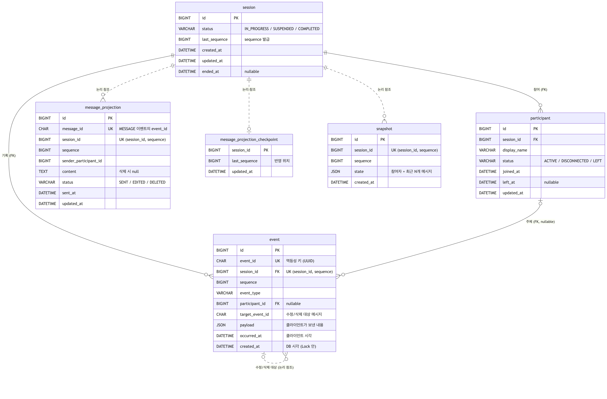

# ERD / DDL

> MariaDB 11.4, 문자셋 `utf8mb4`. 실제 마이그레이션은 [`V1__init.sql`](../src/main/resources/db/migration/V1__init.sql)이며 아래 DDL과 같다 (엔진·문자셋 옵션만 생략). 설계 결정의 근거는 [설계 문서](design.md).

## 1. 테이블 관계



- **실선** = FK가 걸린 관계, **점선** = FK 없이 논리적으로만 참조. 비동기 테이블에 FK를 걸지 않은 이유는 [4장](#4-설계-선택과-트레이드오프)
- 그림 원본: [images/erd.mmd](images/erd.mmd) (Mermaid)

| 테이블 | 갱신 | 담당 |
|---|---|---|
| `event` | append-only | 모든 이력 (Source of Truth) |
| `session` | 동기 | 현재 상태, sequence 발급 (Lock 대상) |
| `participant` | 동기 | 현재 참여자 + 요청 검증 (참여 중인지, 정원) |
| `message_projection` | 비동기 | 현재 메시지 목록 (수정/삭제 반영) |
| `message_projection_checkpoint` | 비동기 | 세션별 message_projection 반영 위치 |
| `snapshot` | 비동기 | 과거 시점 복원 최적화 |

## 2. DDL

```sql
-- 세션: 현재 상태 + sequence 발급 (Lock 대상)
CREATE TABLE session (
  id             BIGINT       NOT NULL AUTO_INCREMENT,
  status         VARCHAR(20)  NOT NULL,              -- IN_PROGRESS / SUSPENDED / COMPLETED
  last_sequence  BIGINT       NOT NULL DEFAULT 0,
  created_at     DATETIME(6)  NOT NULL,              -- = 세션 시작
  updated_at     DATETIME(6)  NOT NULL,
  ended_at       DATETIME(6)  NULL,
  PRIMARY KEY (id),
  KEY idx_session_status_created (status, created_at),
  KEY idx_session_created (created_at),
  KEY idx_session_updated (updated_at)
);

-- 참여자: 동기 Projection
CREATE TABLE participant (
  id            BIGINT       NOT NULL AUTO_INCREMENT,
  session_id    BIGINT       NOT NULL,
  display_name  VARCHAR(50)  NOT NULL,
  status        VARCHAR(20)  NOT NULL,               -- ACTIVE / DISCONNECTED / LEFT
  joined_at     DATETIME(6)  NOT NULL,
  left_at       DATETIME(6)  NULL,
  updated_at    DATETIME(6)  NOT NULL,
  PRIMARY KEY (id),
  KEY idx_participant_session_status (session_id, status),
  KEY idx_participant_display_name (display_name),
  CONSTRAINT fk_participant_session FOREIGN KEY (session_id) REFERENCES session (id)
);

-- 이벤트: Source of Truth
CREATE TABLE event (
  id               BIGINT       NOT NULL AUTO_INCREMENT,
  event_id         CHAR(36)     NOT NULL,            -- UUID 멱등성 키
  session_id       BIGINT       NOT NULL,
  sequence         BIGINT       NOT NULL,
  event_type       VARCHAR(30)  NOT NULL,
  participant_id   BIGINT       NULL,                -- 이벤트 주체 (SESSION_CREATED/ENDED는 NULL)
  target_event_id  CHAR(36)     NULL,                -- 수정/삭제 대상 MESSAGE의 event_id
  payload          JSON         NULL,                -- 클라이언트가 보낸 내용만
  occurred_at      DATETIME(6)  NOT NULL,            -- 클라이언트 시각, 보존용
  created_at       DATETIME(6)  NOT NULL,            -- session 행 Lock 안에서 DB 시각 NOW(6)
  PRIMARY KEY (id),
  UNIQUE KEY uk_event_event_id (event_id),
  UNIQUE KEY uk_event_session_sequence (session_id, sequence),
  KEY idx_event_session_created_sequence (session_id, created_at, sequence),
  KEY idx_event_target (target_event_id),
  CONSTRAINT fk_event_session     FOREIGN KEY (session_id)     REFERENCES session (id),
  CONSTRAINT fk_event_participant FOREIGN KEY (participant_id) REFERENCES participant (id)
);

-- 메시지 Projection: 비동기, 현재 메시지 목록
CREATE TABLE message_projection (
  id                     BIGINT       NOT NULL AUTO_INCREMENT,
  message_id             CHAR(36)     NOT NULL,      -- 원본 MESSAGE 이벤트의 event_id
  session_id             BIGINT       NOT NULL,
  sequence               BIGINT       NOT NULL,      -- 원본 MESSAGE의 sequence
  sender_participant_id  BIGINT       NOT NULL,
  content                TEXT         NULL,          -- 삭제 시 NULL
  status                 VARCHAR(20)  NOT NULL,      -- SENT / EDITED / DELETED
  sent_at                DATETIME(6)  NOT NULL,
  updated_at             DATETIME(6)  NOT NULL,
  PRIMARY KEY (id),
  UNIQUE KEY uk_mp_message_id (message_id),
  UNIQUE KEY uk_mp_session_sequence (session_id, sequence)
);

-- 메시지 Projection 반영 위치
CREATE TABLE message_projection_checkpoint (
  session_id     BIGINT       NOT NULL,
  last_sequence  BIGINT       NOT NULL DEFAULT 0,
  updated_at     DATETIME(6)  NOT NULL,
  PRIMARY KEY (session_id)
);

-- 스냅샷: 비동기, 과거 시점 복원 최적화
CREATE TABLE snapshot (
  id             BIGINT       NOT NULL AUTO_INCREMENT,
  session_id     BIGINT       NOT NULL,
  sequence       BIGINT       NOT NULL,              -- 이 sequence까지 적용한 상태
  state          JSON         NOT NULL,              -- {sequence, status, participants, messages(최근 N)}
  created_at     DATETIME(6)  NOT NULL,
  PRIMARY KEY (id),
  UNIQUE KEY uk_snapshot_session_sequence (session_id, sequence)
);
```

## 3. 인덱스 근거 (핫패스)

| 인덱스 | 사용 쿼리 | 비고 |
|---|---|---|
| `event.uk_event_event_id` | 중복 eventId 확인, 수정/삭제 대상 MESSAGE 조회 | 멱등성 키 |
| `event.uk_event_session_sequence` | Replay 범위 조회 `session_id = ? AND sequence > ? AND sequence <= ? ORDER BY sequence` | sequence 충돌 최종 방어 |
| `event.idx_event_session_created_sequence` | `timeline?at=` → `WHERE session_id = ? AND created_at <= ? ORDER BY created_at DESC, sequence DESC LIMIT 1` (직전 1건만 읽음) | 시점 → sequence 변환 |
| `event.idx_event_target` | 대상 메시지가 이미 삭제됐는지 확인 | |
| `snapshot.uk_snapshot_session_sequence` | `session_id = ? AND sequence <= ? ORDER BY sequence DESC LIMIT 1` | 중복 생성 방지 겸용 |
| `message_projection.uk_mp_session_sequence` | 메시지 목록 페이징 `session_id = ? AND sequence < ? ORDER BY sequence DESC LIMIT ?` | |
| `participant.idx_participant_session_status` | 정원 체크, 현재 참여자 조회 | |
| `participant.idx_participant_display_name` | `GET /sessions` 참여자 필터 | |
| `session.idx_session_status_created` / `idx_session_created` | `GET /sessions` 상태 + 기간 / 기간만 | |
| `session.idx_session_updated` | 안전망 스케줄러의 최근 갱신 세션 조회 | |

핫패스 쿼리 3개의 실행 계획과 대량 데이터(이벤트 110만 건) 측정 결과는 [query.md](query.md)에 있다.

## 4. 설계 선택과 트레이드오프

- **정규화와 비정규화**: 원본인 `event`는 정규화된 append-only 테이블로 두고, 읽기용 상태는 의도적으로 비정규화했다. `session.status`·`last_sequence`는 이벤트에서 계산할 수 있지만 요청마다 Lock을 잡고 검증해야 해서 저장해두고, `message_projection`은 수정/삭제를 반영한 결과를 미리 펼쳐둔 조회 전용 테이블이다. 비정규화한 값은 전부 이벤트로부터 다시 만들 수 있어서, 어긋나도 원본에서 복구된다.
- **내부 PK는 BIGINT AUTO_INCREMENT, UUID는 UNIQUE 보조키**: UUID를 PK(클러스터드 인덱스)로 쓰면 랜덤 INSERT라 페이지 분할이 생김
- **FK는 동기 테이블(`participant`, `event`)에만**: InnoDB는 자식 INSERT 시 부모 행에 공유 락을 잡음. 동기 테이블은 이미 session 행 Lock을 잡은 트랜잭션 안이라 문제없지만, 비동기 테이블에 FK를 걸면 비동기 작업이 이벤트 저장 중인 session 행 Lock을 기다리게 됨 → 비동기 테이블은 논리 참조만
- **checkpoint를 별도 테이블로 분리**: `session`에 두면 비동기 작업이 session 행을 UPDATE해서 같은 Lock 경합이 생김
- **`target_event_id`를 컬럼으로**: payload JSON 내부는 인덱스를 못 타므로 수정/삭제 검증용 참조를 컬럼으로 분리
- **JSON 컬럼**: MariaDB JSON은 `LONGTEXT` + `JSON_VALID` 검사. 이벤트 타입별로 스키마가 다르고, JSON 내부를 검색하지 않으므로 적합
- **`idx_session_updated` 비용**: 이벤트마다 `session.updated_at`이 바뀌어 인덱스도 매번 갱신됨. 1분마다 도는 스케줄러가 전체 세션을 훑지 않게 하기 위해 감수. 앱 시작 시 메시지 목록 복구만 한 번 전체를 훑는다 ([design.md 8장](design.md#dlq-대신-안전망-스케줄러))
- **Snapshot 저장 포맷 버전은 두지 않음**: `SessionState` 형식을 바꿀 일이 없는데 미리 두는 대비책이라 뺐다. 형식을 바꾸게 되면 기존 Snapshot을 삭제하는 마이그레이션을 함께 배포하고, 이후 자동 생성과 안전망 스케줄러가 다시 만든다 (Snapshot은 캐시라 지워도 복원 결과는 같음).
